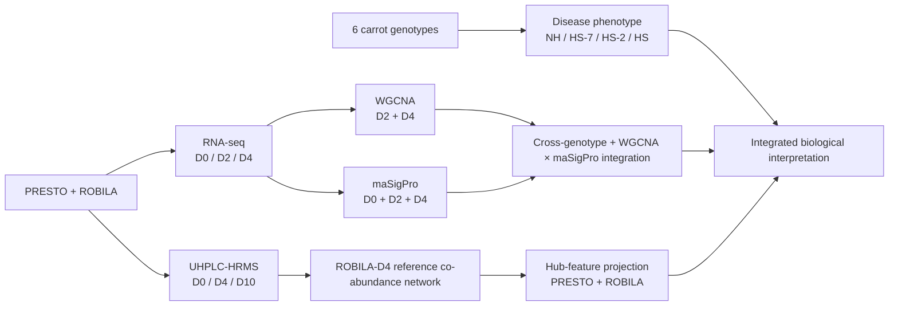

# Carrot heat × *Bacillus* × *Alternaria* multi-omics workflow

Reproducible analysis repository supporting the study **“Heat reshapes carrot defence while *Bacillus*-mediated protection is maintained”**.

The repository organises the supplied analysis scripts into a publication-oriented workflow spanning **disease phenotyping, RNA-seq co-expression networks, maSigPro expression profiles, functional annotation, WGCNA–maSigPro integration, and UHPLC-HRMS co-abundance analysis**. It also records script provenance and separates supplied publication analyses from reconstructed or exploratory components.

> **Security:** this public version contains no institutional filesystem paths, HPC allocations, scheduler directives, partitions, notification email addresses, or private cluster details.

## Study at a glance



### Experimental layers

| Layer | Genotypes | Temperatures | Stages | Main analysis |
|---|---|---|---|---|
| Disease phenotype | DEEP, NANT, NEVA, OXHELLA, PRESTO, ROBILA | NH, HS-7, HS-2, HS | 11–54 DAI | mixed models, AUDPC, AR(1) |
| RNA-seq WGCNA | PRESTO, ROBILA | NH, HS-7, HS-2 | D2, D4 | genotype-specific signed WGCNA |
| RNA-seq profiles | PRESTO, ROBILA | NH, HS-7, HS-2 | D0, D2, D4 | maSigPro shared-baseline profiles |
| UHPLC-HRMS | PRESTO, ROBILA | NH, HS-7, HS-2 | D0, D4, D10 | PLS-DA + ROBILA-D4 co-abundance WGCNA |

**Important:** “all six genotypes” applies to the disease phenotype. The omics analyses in the manuscript are restricted to PRESTO and ROBILA.

## Repository structure

```text
.
├── README.md
├── CITATION.cff
├── config/
│   └── config.R
├── data/                       # phenotype data + schemas/placeholders for large omics data
├── metadata/
│   └── rnaseq_metadata.csv
├── docs/
│   ├── 01_experimental_design.md
│   ├── 02_rnaseq_preprocessing.md
│   ├── 03_transcriptome_wgcna.md
│   ├── 04_masigpro.md
│   ├── 05_functional_dictionaries.md
│   ├── 06_metabolomics.md
│   ├── 07_phenotype.md
│   ├── 08_figure_script_map.md
│   ├── 09_known_gaps_and_reproducibility.md
│   ├── 10_expected_results.md
│   ├── 11_manuscript_to_code_crosswalk.md
│   └── 12_analysis_decisions_and_interpretation.md
├── environment/
│   └── software_versions.tsv
├── references/
│   └── references.bib
└── scripts/
    ├── preprocessing/
    ├── phenotype/
    ├── annotation_builders/
    ├── transcriptomics/
    │   ├── wgcna/
    │   ├── masigpro/
    │   ├── integration/
    │   └── biological_heatmaps/
    └── metabolomics/
        ├── wgcna/
        ├── plsda/
        └── temporal/
```

## Analysis logic

### 1. Disease phenotype — six genotypes

Disease is summarised using AUDPC from seven assessments. The manuscript model treats Treatment, Temperature, Genotype and their interactions as fixed effects and Block as a random intercept. Treatment contrasts are computed within each Genotype × Temperature cell and the 24 P-values are BH-adjusted. Disease trajectories use an AR(1) repeated-measures model. The original phenotype workbook and the supplied phenotype-analysis script are now included in `data/phenotype/` and `scripts/phenotype/`. See [`docs/07_phenotype.md`](docs/07_phenotype.md).

The phenotype dataset contains **192 experimental units** (2 treatments × 4 temperatures × 6 genotypes × 4 replicates/blocks), with seven disease assessments per unit and no missing disease scores. The script also contains a supplementary early/late disease-phase analysis; its Control-only formal models are documented separately because they require alignment with the wording of the current manuscript Methods.

### 2. RNA-seq preprocessing

FastQC → fastp → STAR against DH13M14 → strand-specific featureCounts → MultiQC. Portable shell scripts are in `scripts/preprocessing/`. See [`docs/02_rnaseq_preprocessing.md`](docs/02_rnaseq_preprocessing.md).

### 3. Transcriptomic WGCNA

Networks are built independently for PRESTO and ROBILA from D2+D4. The top 50% most variable genes by MAD are retained after count filtering and DESeq2 VST. Signed bicor networks use β=12 for PRESTO and β=11 for ROBILA, `deepSplit=3`, minimum module size 100 and merge height 0.25.

The **publication module model** is:

```text
ME ~ Block + Temperature * Treatment * Sampling_time
```

with Type III tests and BH correction across modules. See [`docs/03_transcriptome_wgcna.md`](docs/03_transcriptome_wgcna.md).

### 4. maSigPro shared-baseline analysis

D0 is pre-treatment. Therefore the Control D0 observation is used as the common baseline for both Control and Treated series. maSigPro uses degree 2, Q=0.01 and eight expression-profile clusters per genotype. See [`docs/04_masigpro.md`](docs/04_masigpro.md).

### 5. Functional dictionaries

The repository documents exactly how HSP/chaperone, TF, immune/defence and broad functional dictionaries are constructed and curated. Statistical gene selection is kept separate from annotation. See [`docs/05_functional_dictionaries.md`](docs/05_functional_dictionaries.md).

### 6. Metabolomics

The manuscript's reference co-abundance network is based on 24 ROBILA samples at D4, uses signed bicor and β=12, and defines hubs at kME ≥0.70. Reference hub-feature sets are then projected across PRESTO/ROBILA and D0/D4/D10; this projection is **not** claimed as formal network preservation. See [`docs/06_metabolomics.md`](docs/06_metabolomics.md).

## Running the phenotype analysis

The phenotype data are small enough to be included directly in the repository. From the repository root:

```bash
Rscript scripts/phenotype/01_phenotype_analysis.R
```

By default the script reads `data/phenotype/Data_phenotype.xlsx` and writes figures, tables and diagnostics to `outputs/phenotype/`. Local paths can be overridden with `CARROT_PHENOTYPE_FILE` and `CARROT_OUTPUT_ROOT`. See [`scripts/phenotype/README.md`](scripts/phenotype/README.md).

## Running the transcriptomic WGCNA

Provide local inputs via environment variables or edit a private config copy. Then run from the WGCNA script directory so helper sourcing remains deterministic. Example:

```bash
export CARROT_REPO_ROOT=/path/to/carrot-biocontrol-heat-multiomics
export CARROT_RNA_COUNTS=/path/to/gene_counts_featureCounts.txt

cd scripts/transcriptomics/wgcna

CARROT_GENOTYPE=PRESTO Rscript 01_prepare_expression.R
CARROT_GENOTYPE=PRESTO Rscript 02_qc_pca_dendrogram.R
CARROT_GENOTYPE=PRESTO Rscript 03_build_network.R
CARROT_GENOTYPE=PRESTO Rscript 05_hub_genes.R
CARROT_GENOTYPE=PRESTO Rscript 06_go_enrichment.R

CARROT_GENOTYPE=ROBILA Rscript 01_prepare_expression.R
CARROT_GENOTYPE=ROBILA Rscript 02_qc_pca_dendrogram.R
CARROT_GENOTYPE=ROBILA Rscript 03_build_network.R
CARROT_GENOTYPE=ROBILA Rscript 05_hub_genes.R
CARROT_GENOTYPE=ROBILA Rscript 06_go_enrichment.R
```

Then run the publication comparison/integration scripts from `scripts/transcriptomics/integration/`.

## Running maSigPro

```bash
cd scripts/transcriptomics/masigpro
CARROT_GENOTYPE=PRESTO Rscript 01_shared_baseline_maSigPro.R
CARROT_GENOTYPE=ROBILA Rscript 01_shared_baseline_maSigPro.R
```

## Inputs that are intentionally not committed

- FASTQ/BAM/STAR-index files;
- featureCounts matrix if too large for Git;
- raw/vendor LC-MS files and Compound Discoverer projects;
- private institutional filesystem paths;
- large omics matrices and raw instrument/vendor data;
- DH13M14 annotation/mapping resources when redistribution terms are unclear;
- manually annotated LC-MS feature workbooks unless cleared for release.

See [`data/`](data/) for schemas and [`config/config.R`](config/config.R) for local input variables.

## Reproducibility checkpoints

The manuscript reports, among others:

- WGCNA: 11,102 genes / 38 PRESTO samples and 11,317 genes / 37 ROBILA samples;
- non-grey modules: 3 PRESTO, 8 ROBILA;
- maSigPro: 6,417 PRESTO genes and 1,588 ROBILA genes, eight clusters each;
- UHPLC-HRMS: 17,846 features across 120 samples;
- LC-MS reference network: 24 ROBILA D4 samples.

See [`docs/10_expected_results.md`](docs/10_expected_results.md).

## Manuscript-to-code traceability

Every Methods subsection is mapped to the relevant script, its provenance (original, reconstructed, exploratory/legacy), and its expected output in [`docs/11_manuscript_to_code_crosswalk.md`](docs/11_manuscript_to_code_crosswalk.md). Interpretation constraints that materially affect the conclusions are centralised in [`docs/12_analysis_decisions_and_interpretation.md`](docs/12_analysis_decisions_and_interpretation.md).

## Known gaps and script provenance

The phenotype source code and raw phenotype workbook are now included. The PLS-DA script remains reconstructed because the historical PLS-DA source was not supplied. The supplied LC-MS generic WGCNA workflow also differs from the final ROBILA-D4 network scope described in the manuscript. These points are recorded in [`docs/09_known_gaps_and_reproducibility.md`](docs/09_known_gaps_and_reproducibility.md).

## Bibliography

The principal methods and biological references are in [`references/references.bib`](references/references.bib). Core methods include WGCNA (Langfelder & Horvath, 2008), DESeq2 (Love et al., 2014), maSigPro (Conesa et al., 2006), clusterProfiler (Yu et al., 2012; Wu et al., 2021), mixOmics (Rohart et al., 2017), STAR (Dobin et al., 2013), featureCounts (Liao et al., 2014), fastp (Chen et al., 2018) and the DH13M14 T2T carrot genome (Liu et al., 2024).

## Static repository validation

Before pushing a public release, run:

```bash
python scripts/utils/validate_repository.py
```

This checks for accidental HPC/path disclosure, broken literal `source()` links and the expected RNA-metadata schema. It does not replace running the biological analyses on the original data.

## Before public release

1. Replace the placeholder GitHub URL in `CITATION.cff`.
2. Resolve the documented early/late phenotype model wording so the manuscript and supplied script describe the same inference.
3. Add the original PLS-DA script if recovered; otherwise retain the reconstructed implementation with its provenance label.
4. Add the exact ROBILA-D4 LC-MS WGCNA construction script/configuration if recovered.
5. Capture `sessionInfo()` from the final R environment.
6. Confirm redistribution permissions for annotation tables and manually curated metabolite annotations.
